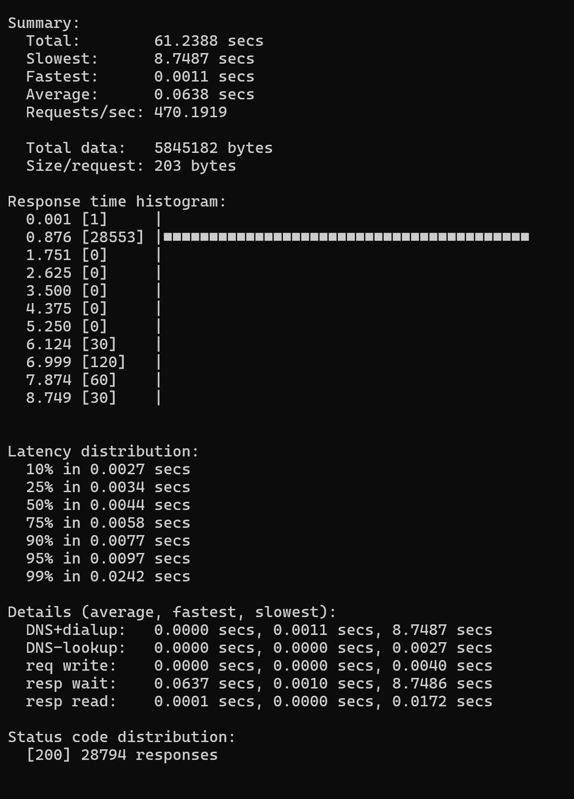

## Запуск

Для запуска потребуется прописать эту команду при открытом Docker

```bash
docker compose up --build
```
или
```bash
make run
```

## Тесты
Тесты находятся в папке [test](pr/test/) \
Запуск: 
```
go test -v -count=1
```
(Не успел сделать тесты на все кейсы)

## Линтер
В проекте используется `golangci-lint` для статического анализа кода. \
Конфигурация: [.golangci.yml](pr/.golangci.yml).\
Использовать можно через: [lint.go](pr/lint.go)

## Нагрузочное тестирование
<div>
  
</div>

## Вопросы/Проблемы
В ТЗ (openapi.yml) написано:
```
Переназначить конкретного ревьювера на другого из его команды
```
Но при таком сценарии мы подбираем ревьювера для PR из другой команды

- Команда 'A': u1 (автор), u2, u3, u4
- PR создан -> назначены ревьюверы: u2, u3
- Потом u2 перемещён в команду 'B'
- Теперь u2 в команде 'B', но он всё ещё назначен на PR из команды 'A'
- Пытаемся заменить u2, но побираем ревьювера в команде 'B', а должны в 'A', т.к. автор PR принадлежит 'A'. 

Это не имеет смысла. Поэтому я реализовал иную логику этого path: /pullRequest/reassign
     